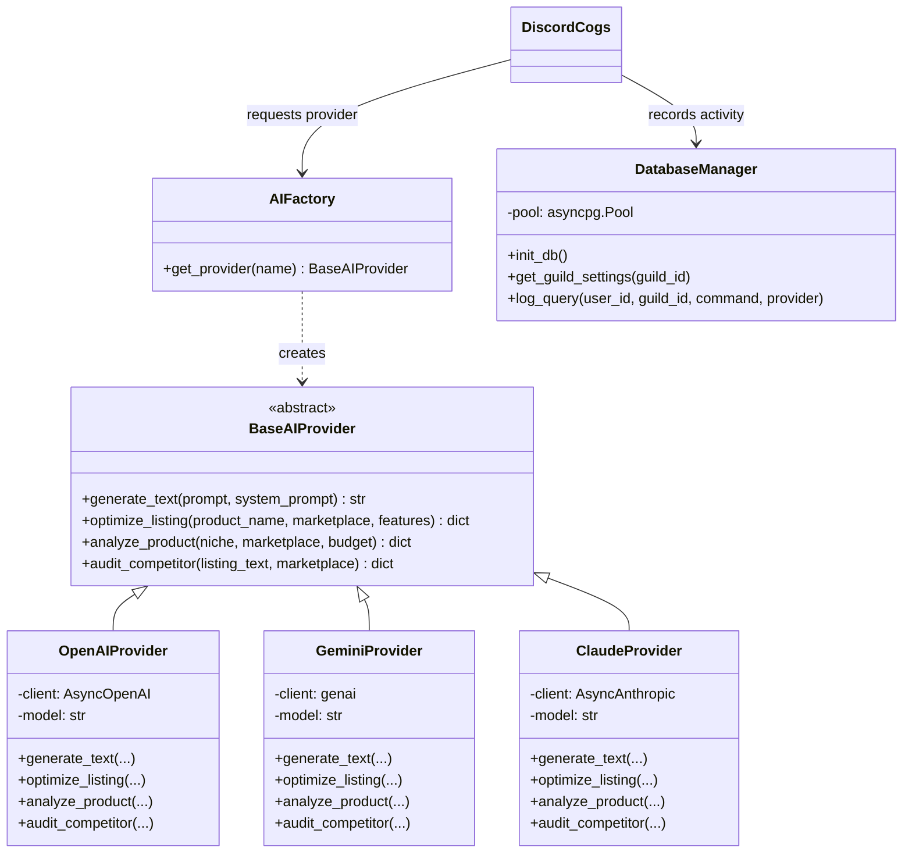

# MarketSpy AI - Technical Implementation Plan & Architecture Blueprint

## Goal Description
Build **MarketSpy AI**, an enterprise-grade AI-powered e-commerce Discord bot tailored for sellers on major marketplaces (Amazon, eBay, Etsy, Shopify, TikTok Shop). 

This plan implements the officially agreed **$125/$150 Core MVP Scope**, engineered with strict **SOLID principles** and a **modular architecture** so that additional AI models (Claude, Mistral, Ollama) and future commercial SaaS monetization (Whop/Stripe, live web scrapers, automated price alerts) can be plugged in without refactoring or breaking existing features.

---

## 1. Scope Extraction & Client Agreement Audit

### What Was Offered & Formally Agreed by the Client:
> **Client's explicit confirmation:**  
> *"Hi Hazrat, Yes, this sounds good to me. You can start building the bot. The proposed scope is clear and I agree with it. Just one important point: please keep the AI architecture modular, so even if we start with OpenAI and Gemini, I can easily add Claude or other LLM providers later without rebuilding the bot. Please also keep PostgreSQL and the overall architecture clean and scalable, as you described. I also expect the complete source code and setup/configuration instructions at delivery. Other than that, you can proceed. Thanks!"*

### Deliverables Breakdown:
1. **MarketSpy AI Branding & Architecture**:
   - Modern `discord.py` 2.x bot with native application Slash Commands (`/`).
   - Rich dark-mode UI with custom embeds, badges, and interactive components (buttons, dropdowns).
   - Cog-based modular architecture.
2. **Modular AI Engine (SOLID-compliant)**:
   - Abstract `BaseAIProvider` interface.
   - Concrete implementations for **Google Gemini** (`gemini-1.5-flash`, `gemini-1.5-pro`) and **OpenAI** (`gpt-4o`, `gpt-4o-mini`).
   - Extensible plug-in architecture with Anthropic Claude pre-scaffolded so the client can enable Claude anytime just by providing an API key.
3. **Core E-Commerce Seller Tools (Slash Commands)**:
   - `/profit-calculator`: Net profit, margin %, ROI %, and fee breakdown with presets for **Amazon FBA**, **Amazon FBM**, **eBay**, **Etsy**, **Shopify**, and **TikTok Shop**.
   - `/optimize-listing`: High-CTR titles, 5 benefit-driven bullet points, SEO-optimized descriptions, and backend keywords.
   - `/product-research`: Deep AI analysis of niche viability, audience persona, margin potential, competition, and risk score.
   - `/competitor-audit`: Competitive teardown highlighting competitor weaknesses, customer complaints, and counter-strategies.
4. **PostgreSQL Database Foundation**:
   - Asynchronous connection pool using `asyncpg`.
   - Scalable schema: `guilds`, `users`, `queries_log`, `settings`.
   - 100% compatible with local PostgreSQL or cloud **Supabase** (Free Tier).
5. **Turnkey Client Delivery Package**:
   - Full commented source code.
   - Comprehensive `README.md` (installation, token setup, Supabase connection, usage guide).
   - `.env.example` with clear parameter documentation.
   - `schema.sql` for 1-click database deployment.

---

## 2. SOLID Architecture & Design Principles



- **Single Responsibility Principle (SRP)**:
  - `services/ai/` handles pure AI prompting and parsing.
  - `database/` handles pure SQL persistence and pooling.
  - `cogs/` handles pure Discord UI presentation, slash command routing, and error catches.
  - `services/calculator/` handles math and platform fee logic independently of Discord.
- **Open/Closed Principle (OCP)**:
  - Adding a new LLM (e.g. Groq, Mistral, Ollama) requires only adding a new file in `services/ai/providers/` implementing `BaseAIProvider` and registering its key in `AIFactory`. No Discord cogs are ever modified!
- **Liskov Substitution Principle (LSP)**:
  - Any AI provider can be swapped at runtime without altering the bot's behavior or outputs.
- **Interface Segregation Principle (ISP)**:
  - Clean, dedicated methods with typed dictionaries for consistent response formatting.
- **Dependency Inversion Principle (DIP)**:
  - Cogs depend exclusively on the abstract `BaseAIProvider` interface, completely decoupled from vendor SDKs.

---

## 3. Planned Project Structure

```
MarketSpy AI/
├── .agent/
│   └── rules/
│       └── project_rules.md      # Strict behavior rules (never code without permission)
├── .agents/
│   └── rules/
│       └── project_rules.md      # Duplicate rule for IDE agents
├── cogs/
│   ├── __init__.py
│   ├── calculator.py             # /profit-calculator command & interactive views
│   ├── listing.py                # /optimize-listing command & embed generator
│   ├── research.py               # /product-research command
│   ├── competitor.py             # /competitor-audit command
│   ├── general_ai.py             # /ask-marketspy general e-commerce Q&A
│   └── settings.py               # /marketspy-settings (admin configuration)
├── database/
│   ├── __init__.py
│   ├── db.py                     # asyncpg connection pool & query helpers
│   ├── schema.sql                # PostgreSQL DDL for tables & indexes
│   └── repository.py             # Domain-specific DB repositories (Guilds, Users, Logs)
├── services/
│   ├── ai/
│   │   ├── __init__.py
│   │   ├── base.py               # Abstract BaseAIProvider definition
│   │   ├── factory.py            # AIFactory for runtime provider resolution
│   │   ├── prompts.py            # E-commerce expert system prompts & templates
│   │   └── providers/
│   │       ├── __init__.py
│   │       ├── openai_provider.py
│   │       ├── gemini_provider.py
│   │       └── claude_provider.py # Pre-scaffolded for client's future use
│   └── calculator/
│       ├── __init__.py
│       ├── fee_models.py         # Amazon, eBay, Etsy, Shopify, TikTok fee math
│       └── profit_engine.py      # Net margin, ROI, and breakdown calculator
├── ui/
│   ├── __init__.py
│   ├── colors.py                 # Custom hex brand palette (MarketSpy Violet, Emerald, etc.)
│   ├── embeds.py                 # Reusable Discord Embed builders
│   └── views.py                  # Interactive Buttons, Dropdowns, and Modals
├── config.py                     # Environment variables validation & dataclasses
├── bot.py                        # Bot entry point, Cogs loader, event listeners
├── requirements.txt              # Pinned, tested dependencies
├── .env.example                  # Environment configuration template
└── README.md                     # Comprehensive setup, deployment & usage documentation
```

---

## 4. Step-by-Step Research & Implementation Roadmap

### Step 1: Configuration & Environment Engine (`config.py`, `.env.example`)
- Create centralized configuration class with validation.
- Provide clean defaults (default AI provider, currency, debug level).
- Create `.env.example` with helpful commentary.

### Step 2: PostgreSQL Database Layer (`database/`)
- Design `schema.sql` with tables:
  - `guilds`: Guild ID, name, registered date, preferred AI model, currency.
  - `users`: User ID, username, total commands run, last active.
  - `queries_log`: Timestamp, user ID, guild ID, command executed, AI provider utilized.
  - `settings`: Key-value storage for global bot configurations.
- Build `database/db.py` with asynchronous connection pooling via `asyncpg`.
- Build graceful fallback: If database is temporarily offline or invalid URL provided, bot logs warning but does not crash, enabling Discord slash commands to work.

### Step 3: Fee Calculation Engine (`services/calculator/`)
- Implement verified marketplace fee formulas:
  - **Amazon FBA**: 15% referral fee average + estimated FBA fulfillment fee tiers + 30-day storage factor.
  - **Amazon FBM**: 15% referral fee.
  - **eBay**: 13.25% Final Value Fee + $0.30 fixed per-order fee.
  - **Etsy**: $0.20 listing fee + 6.5% transaction fee + 3% + $0.25 payment processing.
  - **Shopify**: 2.9% + $0.30 card processing rate + customizable operational overhead.
  - **TikTok Shop**: 6% referral fee + payment processing.
- Output calculations: Revenue, Total Fees, COGS, Shipping, Net Profit, Net Margin %, ROI %, and a Risk/Profitability Health score.

### Step 4: Modular AI Provider Engine (`services/ai/`)
- Implement `BaseAIProvider` with async methods and standardized JSON/dict outputs.
- Build `GeminiProvider` using Google Generative AI SDK with automated markdown/JSON formatting.
- Build `OpenAIProvider` using OpenAI AsyncClient (`gpt-4o` / `gpt-4o-mini`).
- Build `ClaudeProvider` using Anthropic AsyncClient (`claude-3-5-sonnet`) ready out-of-the-box.
- Build `AIFactory` which selects provider from user settings or fallback to `.env` default.
- Build specialized e-commerce system prompts in `prompts.py` tailored for conversion rate optimization (CRO) and seller intelligence.

### Step 5: Discord Bot Presentation & Cogs (`cogs/`, `ui/`)
- Setup `bot.py` with `commands.Bot(command_prefix="!", intents=discord.Intents.default())`.
- Implement `on_ready` sync for global application slash commands.
- Build `ui/embeds.py` with signature MarketSpy styling (Cyber Violet `#6C5CE7`, Profit Emerald `#00B894`, Warning Gold `#FDCB6E`, Loss Red `#FF7675`).
- Implement `/profit-calculator` with interactive fee breakdown buttons.
- Implement `/optimize-listing` with platform selector dropdown.
- Implement `/product-research` with visual score ratings.
- Implement `/competitor-audit` with strategic SWOT analysis.
- Implement `/ask-marketspy` and `/marketspy-settings`.

### Step 6: Documentation & Delivery Packaging (`README.md`)
- Detailed guide on setting up a free **Supabase PostgreSQL** database in under 2 minutes.
- Step-by-step instructions for getting Discord Bot Token & enabling Privileged Gateway Intents.
- How to get OpenAI and Gemini API keys.
- How to run locally (`python bot.py`) or on a 24/7 VPS/cloud host (Railway/Render).

---

## 5. What to Ask the Client (Questionnaire & Supabase Guide)

To prepare for delivery and testing on the client's Discord server, here is the exact information needed from the client:

### Questions / Credentials Needed from Client:
1. **Discord Bot Token**:
   - Has the client already created the bot application in the Discord Developer Portal, or do they want us to generate the instructions for them to paste their token into `.env`?
2. **AI API Keys**:
   - Which API key will they start with?
     - **Google Gemini API Key** (Free tier available at Google AI Studio)
     - **OpenAI API Key** (`sk-...` from platform.openai.com)
3. **Database (PostgreSQL / Supabase)**:
   - The client requested PostgreSQL. The easiest, most reliable, and 100% free cloud host is **Supabase** (takes 2 minutes to create a project, and provides a direct `postgresql://...` connection URI).
   - We will provide them with a 3-step guide to create their free Supabase database, or they can provide their connection URL if they already have one.

---

## 6. Verification Plan

### Automated / Local Verification:
1. **Dependency check**: Verify all packages install and load without conflict in Python 3.14 venv.
2. **Database unit test**: Execute `schema.sql` against a test PostgreSQL instance to ensure valid DDL, primary keys, and foreign keys.
3. **AI Provider test**: Execute mock/test calls against `GeminiProvider` and `OpenAIProvider` to verify standardized output parsing.
4. **Calculator test**: Validate mathematical fee formulas against known real-world Amazon FBA, eBay, and Etsy calculators.

### Manual Verification:
1. Boot the bot and verify slash command registration in Discord.
2. Run `/profit-calculator` with test numbers ($50 sale, $15 COGS, $5 shipping) and verify exact profit/margin breakdown on Amazon FBA and eBay.
3. Run `/optimize-listing` for a sample product (e.g., "Magnetic Wireless Power Bank") on Amazon and verify title, 5 bullet points, and SEO keywords.
4. Run `/product-research` and verify formatting and opportunity score embed.
5. Run `/competitor-audit` with a competitor snippet and verify actionable weaknesses and counter-strategies.
6. Verify query logging in PostgreSQL table `queries_log`.
